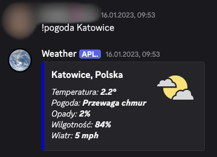

# WeatherScrapper Bot
EN: Python Discord bot. !pogoda <city> scrapes current weather from Google and returns an embed with temperature, conditions, humidity, and wind.

PL: Pythonowy bot Discord. !pogoda <miasto> scrapuje pogodę z Google i wysyła embed z temperaturą, opisem pogody, wilgotnością i wiatrem.

